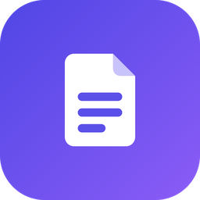

<p align="center">
  
</p>

<h1 align="center">OffNote</h1>

<p align="center">
  <b>Your notes. Your device.</b><br>
  A private notes app for Android that works completely offline.
</p>

<p align="center">
  <a href="https://github.com/ankith5980/offline-notes-releases/releases/latest"><b>⬇️ Download the latest version</b></a>
</p>

---

## What is OffNote?

OffNote is a notes app that keeps everything on your phone. There is no account to create, nothing is uploaded to the cloud, and it works without an internet connection. Write notes, make checklists, sketch drawings, attach photos and files, set reminders, and lock the app or individual folders behind a PIN or your fingerprint.

## What's new in 3.2.1

- **Tidier text blocks:** an empty text slot no longer sits under a list or drawing (a checklist note is just the list). Tap below the note, or press **Enter** in the title, to start writing. **Backspace** in an empty text block removes it, and at the start of a text block it joins it to the text above. Drag handles appear only beside blocks with something in them, and only when there are two or more.
- **Folder PIN** looks like the App Lock screen (on Windows it fills the window).
- **Checklists:** each task now lines up exactly with its tick box and its ✕.
- **Phone:** the empty home screen no longer mentions a keyboard shortcut.

## What's new in 3.2.0

- **Arrange a note your way.** A note's text, task lists, drawings, photos, voice notes and files are now separate blocks you can put in any order: drag a block by the handle on its left (on the phone, touch and hold the handle first), or tap the handle for **Move Up**, **Move Down**, **Add Text Below** and **Delete**. A note can have **several blocks of text**, so text can sit above a list and more text below it: add one with the **New Text Block** button in the toolbar or **⋮ → Add Text Block**. Exports (Markdown, text, HTML, PDF) follow the same order. See [Arrange a note](#arrange-a-note).
- **Read mode is truly read-only.** While reading, nothing in the note can be changed by accident: no typing, no ticking tasks, no deleting attachments or tags. Voice notes still play, attachments still open and links still work.
- **Tap anywhere below the text** to start typing at its end.
- **Read time counts everything:** task lists, drawings and photos, files, and how long the voice notes are, not just the words.
- **Turning off App Lock asks for your PIN** (or your fingerprint, if it's on), so someone holding your unlocked phone can't switch it off.
- **On Windows:** messages such as "Note archived · Undo" appear as a small card at the top of the window, which fades away by itself. Choices and forms that used to slide up from the bottom (tags, colours, folders, the template preview) open as compact dialogs in the middle instead of stretching across the window. A clicked button or menu no longer stays grey. The welcome pages and the update dialog are cleaner (the update now shows its size and a list of what's new), the mouse wheel scrolls smoothly, and the checklist's tick box highlights in the right place.
- **Smoother everywhere:** switching between light and dark no longer stutters, opening a note slides in without a jump, and the welcome pages are new, with a gentle hand-over to your notes after **Get started**.
- **On the phone:** pressing a settings option or the search bar now shows a rounded highlight that fits its shape, instead of a square block, and swiping a note to archive shows a small round **Archive** badge beside it instead of a box behind the card.

## What's new in 3.1.0

**OffNote for Windows, much improved:**
- **Voice-to-text on your PC.** Record voice notes and have them written out, or click **Dictate** (or press **Ctrl+Shift+D**) and what you say is typed into your note. It all happens on your PC, without internet; the first time, OffNote downloads its speech model (57 MB, or 181 MB for the more accurate one). See [Voice notes and dictation on Windows](#voice-notes-and-dictation-on-windows).
- **Lists keep up with you.** Favourite, pin or rename a note and it shows in the right place straight away. Before, the lists only caught up when you closed the note.
- **Counts** next to All Notes, Favorites, every folder and tag, Archive, Trash and Reminders.
- **New ▾** button for a note, checklist, **code note**, drawing, voice note or a template. Create **folders** and **tags** with the **+** next to their headings, and right-click them to edit, lock or delete.
- **Archive and Trash** list notes beside a preview, like your other notes: **Unarchive**, **Restore** or **Delete Forever** straight from the list (hover over a note, or right-click it), and **Empty** the Trash in one click.
- **Cards, List or Compact:** the layout button above the notes now works. **Quick filters** (Pinned, Favorites, Tasks, Reminders, Code, Attachments) sit under the search.
- **Hover and right-click a note** to pin, favourite, colour, move, tag, duplicate, export, archive or delete it. **Ctrl+click** or **Shift+click** to select several notes, then act on all of them. Drag notes onto a folder, tag, Archive or Trash in the sidebar.
- **Formatting shortcuts:** Ctrl+B, Ctrl+I, Ctrl+E, Ctrl+K, Ctrl+1/2/3 and more (Ctrl+/ shows them all). The inspector moved to **Ctrl+Shift+I**.
- **App Lock reads your keyboard:** type your PIN instead of clicking it.
- **Fixed:** using a template no longer breaks the window (and moving that note to the Trash no longer leaves it blank); **Bold** with nothing selected no longer draws a line across the note; Ctrl+Delete while typing deletes a word instead of the note; "None (Root Notes)" in Move to Folder now really takes a note out of its folder.

**On the phone too:** Bold, italic and the other buttons format the whole word when the cursor is inside it, and a Bold pressed by mistake on an empty line goes away by itself. Pin, favourite and tag buttons inside a note never undo what you just typed.

## What's new in 3.0.0

- **OffNote for Windows.** A desktop app with three columns: folders, tags and smart folders on the left, your notes in the middle, the note on the right with its linked references beside it. Keyboard shortcuts (Ctrl+N, Ctrl+F, Ctrl+S, and **Ctrl+P** for a command palette), **Quick Capture** from anywhere with **Ctrl+Alt+N**, and it keeps running in the system tray. It updates itself like the phone app. See [OffNote for Windows](#offnote-for-windows).
- **Smart folders** (Windows): Today, This Week, Checklists, With Reminders, With Attachments, Code Notes and Untagged, plus any search you save.

## What's new in 2.9.1

- **Home screen widgets:** start a note, checklist, voice memo, drawing or code note in one tap with **Quick capture**; tick off tasks straight from the home screen with **Checklist**; keep a favourite note or quote in view with **Sticky note**. See [Home screen widgets](#home-screen-widgets).
- **Code notes tell the language much better:** Java is no longer mistaken for TypeScript, and C, Kotlin, Dart, C#, Go and the rest are recognised far more reliably. The note's card and the note itself always name the same language.

## What's new in 2.9.0

- **Code notes:** keep snippets of code in a note made for them, with line numbers and colours for 35 languages (Dart, Python, JavaScript, TypeScript, Java, Kotlin, Go, Rust, SQL, Bash, C/C++, C#, HTML, CSS, JSON, YAML and more). OffNote can tell the language by itself, **Copy Code** copies it all in one tap, and a bar of symbols ({ } ( ) ; = and more) saves hunting on the keyboard. See [Code notes](#code-notes).

## What's new in 2.8.0

- **Links between notes that you can follow:** type `[[` in a note and OffNote suggests your notes as you type; tap one to link it, or press **Enter** to link the note with that exact name (or create it if there isn't one yet). See [Links between notes](#links-between-notes).
- **Read mode:** tap the book icon at the top of a note to read it without the keyboard popping up. In Read mode, tap a link to open that note. OffNote remembers which mode you used last.
- **Linked References** at the bottom of a note now open the notes that link to it.
- **Move to Folder** has moved into the note's **⋮** menu, to make room for the Read/Edit button.

## What's new in 2.7.2

- **Several attachments at once:** pick many photos or files in one go, and long-press attachments in a note to select several, then share or delete them together. See [Add photos, files and drawings](#add-photos-files-and-drawings).

## What's new in 2.7.1

- **Sharp photos in PDFs:** photos in a PDF export are now exactly as you took them (with **Full quality**, the default), instead of being shrunk, so small text in a photo stays readable when you zoom in. **Smaller file** keeps PDFs small. See [Export as PDF](#export-as-pdf).

## What's new in 2.7.0

- **Voice notes:** record your voice right inside a note, pause and carry on, and watch the sound as you speak. Play it back with a waveform you can tap or drag through, skip 10 seconds back or forward, or speed it up. See [Voice notes](#voice-notes).
- **Speech turned into text, on your phone, when you want it:** tap **⋮ → Transcribe** on a recording and its English speech is written out line by line with the time each line was said, and tapping a line plays the recording from there. Search finds notes by words that were only spoken. This uses your phone's own speech recognition (Android 13 or newer), so your recordings never leave your phone.
- **Export as PDF** (new in 2.6.0): turn any note into a print-ready PDF on A4 or US Letter, with the margins you choose, optional dates, tags and task progress, sharp photos and drawings, and page numbers and a contents page for long notes. Malayalam, Hindi and other scripts and emoji come out exactly as on your phone, and you can look through every page before sharing. See [Export as PDF](#export-as-pdf).
- **Version history, fixed and improved** (2.6.0): restoring an earlier version now really brings it back (before, it could be overwritten when you left the note), and your note as it was is kept first, with **Undo**. Versions now include task lists, you can read a version in full and compare it with your note line by line, and you can delete versions. A version is saved when you come back to edit a note and every 10 minutes while you keep editing, instead of filling up with near-copies. See [Version history](#version-history).
- **Templates** (new in 2.5.0): start a note from Daily Journal & Gratitude, Meeting Minutes, Project Plan / Sprint Log, Cornell Study Notes or Weekly Review & Habit Tracker, or save any note as your own template. See [Templates](#templates).

## Features

- **Notes with formatting**: headings, bold, italic, strikethrough, highlights, lists, quotes and code, shown right in the note as you write.
- **Select several notes at once**: long-press a note, tap others, then pin, favourite, archive, move, tag, colour, duplicate, export or delete them all together.
- **Checklists**: add as many named task lists as you like to a note (for example "Groceries" and "Packing") and tick off tasks right inside it. Each list shows how many tasks are done, and the note's card shows the overall percentage. Press Enter to add the next task; long tasks wrap onto more lines.
- **Templates**: start a note from a ready-made layout (Daily Journal & Gratitude, Meeting Minutes, Project Plan / Sprint Log, Cornell Study Notes, Weekly Review & Habit Tracker), or save any note as your own template.
- **Drawings**: sketch with your finger and save the drawing in the note. The drawing board never ends: move around it in any direction and pinch to zoom in for fine detail, like in Figma.
- **Voice notes**: record with pause and resume, play back with a waveform you can scrub through, and get the English speech written out with times you can tap to jump to, all on your phone.
- **Photos and files**: take a photo, pick from your gallery, or attach documents (PDF, Word, Excel and more).
- **Reminders**: one-time or repeating (daily, weekly, monthly), with Snooze and Done buttons on the notification.
- **Folders, tags and colours** to keep things organised. Long folder names, note titles and tags scroll by themselves so you can read them in full.
- **Pin and favourite** your most important notes.
- **Archive** notes you want to keep but don't need to see every day.
- **Trash** with automatic clean-up after the number of days you choose.
- **Fast search** across titles, text, checklists, tags, folders and the words spoken in voice notes.
- **Version history**: see earlier versions of a note, compare them with the note now, and bring one back (text and task lists).
- **Note links**: type `[[` to link to another note (OffNote suggests them as you type), then tap the link in **Read mode** to open it. Each note lists the notes that link to it.
- **App lock** with a 4-digit PIN and fingerprint/face unlock.
- **Locked folders**: keep private folders behind their own folder PIN or fingerprint, separate from the app lock.
- **Backup and restore** everything to a single file.
- **PDF export**: print-ready PDFs on A4 or US Letter with the margins you choose, sharp photos and drawings, and page numbers and a contents page for long notes. Malayalam, Hindi and other scripts and emoji come out exactly as on your phone.
- **Import and export** notes as Markdown, text, JSON or HTML (and import from Google Keep). In HTML exports, photos and drawings open in a viewer you can zoom and move around.
- **Light and dark themes** with a one-tap switch on the home screen, and card, list or compact layouts.
- **Automatic saving**: there's no save button; your notes save as you type.
- **In-app updates**: get new versions without the Play Store.
- **Windows app**: the same notes app on your PC, in three columns, with shortcuts, a command palette, smart folders, Quick Capture from the tray, and voice-to-text with dictation. (Notes stay on each device; move them with Backup & Restore.)

## Requirements

- **Phone:** an Android phone or tablet running **Android 7.0 or newer**, with about 70 MB of free space
- **PC:** Windows 10 or 11 (64-bit), with about 100 MB of free space (plus 57 or 181 MB for the speech model, if you use voice-to-text)

---

## Installing OffNote

OffNote isn't on the Play Store, so you install it directly from this page.

1. On your phone, open the **[latest release](https://github.com/ankith5980/offline-notes-releases/releases/latest)**.
2. Under **Assets**, tap the file ending in **`.apk`** (for example `offnote-v2.7.0.apk`) to download it.
3. Open the downloaded file (from your notifications or the **Downloads** / **Files** app).
4. If Android says *"For your security, your phone is not allowed to install unknown apps from this source"*, tap **Settings**, turn on **Allow from this source**, then go back.
5. Tap **Install**, then **Open**.

> **Note:** Android may show a Play Protect warning because the app doesn't come from the Play Store. Tap **More details → Install anyway** to continue.

## Updating OffNote

You don't need to come back to this page for updates.

- OffNote checks for a new version each time you open it. When one is available you'll see **"Update available"** with a list of what's new.
- You can also check any time in **Settings → Check for Updates** (open Settings from the menu ☰ on the home screen).
- Tap **Update**, wait for the download, then tap **Install**. The first time, Android may ask you to allow OffNote to install apps; allow it and go back.

**Your notes, folders, tags and settings are kept when you update.**

---

## OffNote for Windows

### Install
1. Open the **[latest release](https://github.com/ankith5980/offline-notes-releases/releases/latest)** on your PC and download **`OffNote-Setup-…exe`** under **Assets**.
2. Run it. Windows may say *"Windows protected your PC"*, because the installer isn't signed by a paid certificate: click **More info → Run anyway**.
3. Follow the steps (no administrator password needed; it installs just for you). OffNote opens when it's done and is in the Start menu.

OffNote for Windows keeps its own notes, separate from your phone (nothing is synced, there's no cloud). To bring your phone's notes over: on the phone, **Settings → Backup & Restore → make a backup**, copy the file to your PC, then on the PC **Settings → Backup & Restore → restore** it.

### The window
- **Left:** **New ▾** (a note, checklist, code note, drawing, voice note or template), All Notes, Pinned, Favorites, your **folders** (locked ones ask for the folder PIN), **tags**, **smart folders**, then Archive, Trash, Reminders, Templates and Settings. The number beside each one is how many notes it holds. Click **+** next to *Folders* or *Tags* to make a new one; right-click a folder or tag to edit, lock or delete it.
- **Middle:** the notes, with the **search** field, **quick filters** (Pinned, Favorites, Tasks, Reminders, Code, Attachments), the **layout** button (Cards, List or Compact) and the **sort** button (last modified, date created, title A–Z or Z–A, and whether pinned notes stay on top). Up and Down move between notes.
  - **Hover** over a note for quick buttons (pin, favourite, archive, delete); **right-click** it for everything else (colour, move to folder, tags, duplicate, export).
  - **Ctrl+click** notes (or **Shift+click** for a run of them, **Ctrl+A** for all) to select several, then use the bar at the top. **Delete** moves them to the Trash, **Esc** clears the selection.
  - **Drag** a note (or the selected notes) onto a folder, tag, Pinned, Favorites, Archive or Trash in the left column.
- **Right:** the note itself, with the **inspector** beside it: the notes that link to it, the notes it links to, and its details. Hide or show it with the button at the top or **Ctrl+Shift+I**.
- **Archive** and **Trash** work the same way: click a note to see it (archived notes can be edited, with an **Unarchive** button; notes in the Trash show read-only with **Restore** and **Delete Forever**). **Empty** at the top of the Trash deletes everything in it.
- Drag the lines between the columns to make them wider or narrower. In a narrow window OffNote looks like the phone app.

### Keyboard shortcuts
| Keys | What it does |
|---|---|
| **Ctrl+N** | New note (**Ctrl+Shift+N**: new checklist) |
| **Ctrl+F** | Search |
| **Ctrl+S** | Save now (OffNote also saves as you type) |
| **Ctrl+P** | Command palette: type to find any command, folder, tag or note, then Enter |
| **Ctrl+Shift+I** | Show or hide the inspector |
| **Ctrl+/** | All keyboard shortcuts |
| **Ctrl+,** | Settings |
| **Ctrl+Delete** | Move the open note to Trash (when you're not typing in it) |
| **Ctrl+Alt+N** | **Quick Capture**, from any app |

While writing in a note:

| Keys | What it does |
|---|---|
| **Ctrl+B** / **Ctrl+I** | Bold / italic (with nothing selected, the word the cursor is in) |
| **Ctrl+Shift+X** / **Ctrl+Shift+H** | Strikethrough / highlight |
| **Ctrl+E** | Code |
| **Ctrl+K** | Link to another note |
| **Ctrl+1**, **Ctrl+2**, **Ctrl+3** | Heading 1, 2, 3 |
| **Ctrl+Shift+8** / **Ctrl+Shift+7** / **Ctrl+Shift+9** | Bullet list / numbered list / quote |
| **Ctrl+Z** / **Ctrl+Y** | Undo / redo |
| **Ctrl+Shift+D** | Start or stop dictation |

If App Lock is on, type your PIN on the keyboard (or click it); Backspace deletes a digit.

### Smart folders
Ready-made lists that fill themselves: **Today**, **This Week**, **Checklists**, **With Reminders**, **With Attachments**, **Code Notes** and **Untagged**. To make your own, search for something and click the **bookmark** button in the search field (**Save as Smart Folder**); right-click it in the sidebar to rename or delete it.

### Quick Capture and the tray
- Press **Ctrl+Alt+N** anywhere in Windows: a small box opens to jot a title and some text. **Ctrl+Enter** saves it as a new note, **Esc** cancels.
- Closing the window (**X**) keeps OffNote running next to the clock, so Quick Capture and reminders keep working. Click the OffNote icon there to open it; right-click it for **Quick Capture**, **New Note**, **Settings** or **Quit**. To have **X** quit instead, turn off **Settings → Desktop → Keep Running in the Tray**.
- Reminders show as Windows notifications while OffNote is running (also in the tray). Reminders that came due while it was closed show as "Missed reminder" when you open it.

### Voice notes and dictation on Windows
- **Record a voice note:** the microphone button under the note (or **⋮ → Record Voice Note**). Play it back with the waveform, like on the phone.
- **Turn it into text:** **⋮ → Transcribe** on the recording. The words are written out line by line, with the time each was said; click a line to play from there. To transcribe every new recording by itself, turn on **Settings → Voice Notes → Transcribe new recordings**.
- **Dictate:** click the **Dictate** button under the note (next to the microphone) or press **Ctrl+Shift+D**, and speak. Pause briefly between sentences: each one is typed in where the cursor is, a moment after you pause. Click **Stop** (or press Ctrl+Shift+D again) to finish.
- **The speech model:** the first time, OffNote asks to download its speech model, once: **Standard** (57 MB, quick) or **Accurate** (181 MB, better with accents and noise, about three times slower). Choose and manage it in **Settings → Voice Notes**. It understands English.
- **Private:** your recordings and what you dictate are turned into text on your PC and never leave it. The model download (from huggingface.co) is the only thing OffNote fetches for this, and only when you ask for it.
- If Windows asks whether OffNote may use the microphone, allow it (or turn it on in **Windows Settings → Privacy & security → Microphone**).

### Updates
OffNote for Windows checks this page for a new version when it starts (or **Settings → Check for Updates**). Click **Update**: it downloads the new version, closes, updates itself and opens again. Your notes are kept.

### Where your notes are, and uninstalling
Your notes, attachments and backups are in `%APPDATA%\OffNote\OffNote` on your PC. Uninstall from **Windows Settings → Apps → OffNote**; your notes stay in that folder unless you delete it.

### Not on Windows yet
PDF export (export as HTML and print that to PDF from your browser instead), taking photos with a camera, and home-screen widgets. Unlocking locked folders with Windows Hello (folders open with their folder PIN on Windows; the app itself can unlock with Windows Hello).

---

## Getting started

### Create a note
Tap **+ Note** at the bottom right and choose:
- **Text Note** for normal notes
- **Checklist Task** for a to-do list
- **Drawing Note** to start with a sketch
- **From Template** to start from a ready-made layout (see [Templates](#templates))

Give it a title and start typing. Everything saves automatically. Tap the back arrow when you're done.

### Templates
Templates give a new note its headings, prompts and task lists, so you only fill in the blanks.

- **Use a template:** tap **+ Note → From Template**, or open the menu (☰) and tap **Templates**. Tap a template to see a preview, then tap **Use template**. The new note opens straight away. If you start it from inside a folder or a tag, the note goes into that folder or gets that tag.
- **Built-in templates:**
  - **Daily Journal & Gratitude**: mood, three things you're grateful for, top 3 priorities and a recap of the day.
  - **Meeting Minutes**: date and time, attendees, agenda, decisions and an "Action items" list.
  - **Project Plan / Sprint Log**: overview, goals, risks, "Milestones" and "Deliverables" lists, and a dated sprint log.
  - **Cornell Study Notes**: cues, notes and a summary, plus a short review checklist.
  - **Weekly Review & Habit Tracker**: wins, challenges, lessons and next week's focus, with a Monday-to-Sunday list for each habit (rename the habits to your own).
- **Save your own:** open any note, tap **⋮ → Save as Template** and give it a name. The template keeps the note's title, text, task lists (with every task unticked), colour and tags. Photos, files, drawings and reminders are not included. Your templates appear under **My templates**, where **⋮** lets you rename or delete them. Deleting a template doesn't change notes already made from it.
- **Automatic dates:** write `{{date}}`, `{{weekday}}`, `{{time}}` or `{{week}}` (the week number) in a note's title or text before saving it as a template. Each note made from the template gets that day's date, day, time or week number instead.
- Your templates are included in backups.

### Format your text
Use the formatting toolbar at the bottom of the note to add headings (**H1**, **H2**, **H3**), **bold**, *italic*, ~~strikethrough~~, highlights, bullet and numbered lists, quotes, code and dividers.

- The formatting shows **right in the note**: headings are large, bold text is bold, highlights are highlighted, quotes have a coloured bar down their side, dividers are drawn as a line across the note, and code blocks sit in a shaded box.
- Select some text first to format it, or tap a button and start typing.
- Tap a button again to **remove** that formatting. Choosing another heading size replaces the old one.
- Lists, quotes and headings apply to every line you've selected.
- The buttons light up to show the formatting where your cursor is.
- On the line you're editing, small faded symbols (like `#` or `**`) appear so you can change the formatting by hand; they disappear when you move to another line. While your cursor is inside a code block, its ``` marks show in colour at the top and bottom of the box, and the ` marks around inline code show while you edit that line.
- Made a mistake? Tap **Undo** (↶) at the left of the toolbar, and **Redo** (↷) to bring the change back. They undo typing and formatting alike, a few words at a time.
- Very long notes are edited in parts behind the scenes so typing stays smooth. You won't see the parts, but in a very long note a text selection (and Undo) covers one part, a few paragraphs, at a time.

### Links between notes
Link one note to another by writing its title in double square brackets, like `[[Packing list]]`. The link shows in colour.
- **Suggestions:** as soon as you type `[[`, a list of your notes appears above the formatting bar and narrows down as you type. Tap a note to put in its link. (Notes in locked folders aren't suggested.)
- **Enter:** if a note has exactly the name you typed, Enter links it; otherwise Enter **creates a new note** with that name (in the same folder) and links it. The row Enter will pick is highlighted. Tap **✕** on the list to close it.
- **Open a link:** tap the **book icon** at the top of the note to switch to **Read mode**, then tap the link. Tap the back arrow to return. If no note has that name yet, OffNote offers to create it.
- **Linked References:** at the bottom of a note you see every note that links to it; tap one to open it.

### Code notes
Tap **+ Note → Code Note** to start one.
- **Language:** the button at the top left of the code (for example **Python ▾**) chooses how it's coloured; search the list or pick **Auto** to let OffNote tell from the code. New code notes start with the last language you chose.
- **Line numbers** run down the left. Long lines scroll sideways; tap the **wrap** button to fold them onto the next line instead (OffNote remembers your choice).
- **Copy Code** copies the whole code, ready to paste.
- **Typing:** the bar under the code has Undo/Redo, **Indent** and **Outdent**, and the symbols code needs. Press Enter and the new line keeps the indentation (one step more after `{`, `(` or a Python `:`).
- Code notes work with everything else: tags, folders, search, Read mode, version history, backups, and exports (Markdown as a code block, PDF, HTML, text and JSON).
- Very long code is edited in parts behind the scenes so typing stays smooth; a selection (and Undo) covers one part, about 60 lines, at a time.

### Home screen widgets
Touch and hold an empty spot on your home screen, tap **Widgets**, find **OffNote** and drag one onto the screen:
- **Quick capture:** buttons for a new **Note**, **Checklist**, **Voice** memo (recording starts at once), **Drawing** and **Code** note. Make it wider to see the names under the buttons.
- **Checklist:** pick a note with tasks when you place it; tap a task on the home screen to tick it off (or back on). Tap the title to open the note.
- **Sticky note:** pick any note; it shows on the home screen in the note's colour, with its text and tasks. Tap it to open the note.

You can also add a note from inside it: **⋮ → Add to Home Screen**, then choose Sticky note or Checklist and confirm where Android puts it. To show a different note, touch and hold the widget and choose **Reconfigure** (or remove it and add it again).

Privacy: notes in **locked folders** are never shown on the home screen. While **App Lock** is on, Sticky note and Checklist widgets show **Locked** instead of the note, unless you turn on **Settings → Show Notes in Home Screen Widgets**. Quick capture always goes through the lock screen first.

### Read mode
Tap the **book icon** at the top of a note to read it: the keyboard stays away, the formatting symbols never appear, and links can be tapped. Tap the **pencil** to edit again. OffNote remembers the mode you used last and opens notes in it (new, empty notes always open ready to type).

Read mode is only for reading: the text, title, tags, task lists and attachments can't be changed (tasks can't be ticked either). Voice notes still play, attachments and drawings still open to look at, and links still work. Pin, favourite, colour and reminders stay available at the top.

### Add photos, files and drawings
In a note, tap **⋮** (top right) and choose **Take Photo**, **Pick Image from Gallery**, **Attach Document** or **Add Hand Drawing**. Tap an attachment to open it.
- **Several at once:** in **Pick Image from Gallery** and **Attach Document** you can choose as many photos or files as you like in one go.
- **Select several in a note:** long-press a photo, drawing or file, then tap others to add them (tap again to leave one out). The bar at the bottom shows how many are selected, with **Select All**, **Share** (sends them together) and **Delete** (asks first). Tap **✕** or Back to stop selecting.

### Voice notes
**Record:** in a note, tap the **microphone** in the formatting bar (or **⋮ → Record Voice Note**). The first time, allow OffNote to use the microphone. While recording you see the time and the sound as moving bars.
- Tap **Pause** to take a break and the **microphone** button to carry on; the pause isn't recorded. Recording also pauses if you leave the app.
- Tap **✓** to save the recording in the note, or the **bin** to throw it away.

**Play:** the recording appears in the note as a player. Tap **▶** to play, tap or drag along the waveform to jump to any moment, use the **10-second** buttons to go back or forward, and tap **1×** to play at 1.5× or 2× speed.

**Text from speech:** recordings aren't turned into text unless you ask. Tap **⋮** on the player and choose **Transcribe**; it starts straight away, on your phone:
- The text appears under the player, line by line, with the time each line starts. **Tap a line** to play the recording from there; the line being played is highlighted.
- Search finds the note by any word in that text.
- **⋮** on the player: **Transcribe** (or **Transcribe Again**), **Copy Text**, **Add Text to Note** (adds it at the end of the note's text) and **Delete Voice Note**.
- It understands **English** only (choose your accent under **Settings → Voice Notes**; Automatic works for most people). Names and unusual words may come out wrong or be missed.
- It needs **Android 13 or newer** with Google's speech services, which most phones have. The first time, your phone needs its offline English speech pack: tap **Get It** on the player, or go to **Settings → Voice Notes → Download**. Choosing **Transcribe** also asks your phone to download it. Your phone downloads the pack (it may wait for Wi-Fi), and recordings waiting for it are turned into text as soon as it arrives. On older phones you can still record and play voice notes.
- To have every new recording transcribed by itself, switch on **Transcribe new recordings** in **Settings → Voice Notes** (it's off at first).

Voice notes and their text are included in backups and in exports (Markdown, text, JSON, HTML and PDF list each recording with its text).

### Draw, zoom and move around
The drawing board is endless in every direction, with faint dots so you can see it move. It opens at **100%**, which is also as far out as it zooms.

| To… | Do this |
|---|---|
| Draw | Use one finger (a tap makes a dot) |
| Zoom in or out | Pinch with two fingers; the spot between your fingers stays put |
| Move around | Drag with two fingers, as far as you like in any direction (you can pinch and drag at the same time) |
| Zoom in steps | Tap **−** or **+** in the zoom bar at the bottom right |
| Jump to a zoom level | Tap the **%** in the zoom bar and choose 100%, 200%, 400% or 700% |
| Get back to where you started | Tap the **%** and choose **Back to start** |

- You can zoom from **100% to 700%**. Pen and marker lines are sized to the drawing, so they look thicker when you zoom in, just as they will in the saved drawing.
- When you save, the drawing includes the area you started on plus anything you drew outside it.
- If a second finger touches down while you're drawing a line, that line is cancelled and the board zooms instead, so you won't get stray marks.
- With a mouse: scroll to move, **Ctrl + scroll** to zoom, and drag with the right or middle button to move.
- Drawings are saved in high resolution, so they stay sharp when you zoom in on them later.

### Organise your notes
- **Pin:** tap the pin icon in a note to keep it at the top of your list.
- **Favourite:** tap the star.
- **Colour:** tap the palette icon.
- **Folder:** tap **⋮ → Move to Folder**.
- **Tags:** tap **⋮ → Manage Tags**.
- **Long-press** any note in the list to select it and see its actions (see below).
- The buttons along the top of the home screen (**All Notes, Pinned, Favorites, Tasks, Reminders**) filter your list.
- Tap the layout icon at the top to switch between **grid, list and compact** views.
- Tap the theme icon next to it to switch between **Auto, Light and Dark**. Each tap moves to the next one, and the colours change smoothly. **Auto** follows your phone's own light/dark setting.

### Select several notes at once
1. **Long-press** a note. A tick appears on it and the bar at the top shows how many notes are selected.
2. **Tap** other notes to add them (tap a selected note again to remove it), or tap the **select-all** icon at the top right.
3. Choose what to do from the bar at the bottom: **Pin**, **Favorite**, **Archive**, **Move** (to a folder) or **Trash**. Tap **More** for **Manage Tags**, **Change Color**, **Duplicate** and **Export**.

- To stop selecting, tap **✕** at the top left or press your phone's **Back** button.
- If all the selected notes are already pinned (or favourites), the button changes to **Unpin** (or **Unfavorite**).
- **Manage Tags** shows the tags all the selected notes share. Tags you tick are added to all of them; shared tags you untick are removed from all of them. Tags only some of the notes have are left alone.
- Archiving or moving notes to Trash shows an **Undo** button for a few seconds.
- Selecting works the same way inside a folder (with **Remove from Folder**), a tag (with **Remove** that tag), the **Archive** (with **Unarchive**) and the **Trash** (with **Restore** and **Delete Forever**).

### Checklists (task lists)
- **Add a task list:** in a note, tap the **checkbox** button in the formatting toolbar, or **⋮ → Add Task List**. Every tap adds a **new, separate list**, so one note can hold several, like "Groceries", "Packing" and "Calls to make".
- **Name a list:** the cursor starts in the new list's name field; type a name and press **Enter** to jump to its first task. Tap the name any time to change it. A list without a name is shown as "Tasks".
- **Add tasks:** type a task and press **Enter** on the keyboard to start the next one; the keyboard stays open. Each task starts with a capital letter, and long tasks wrap onto more lines. You can also tap **Add task** under a list.
- **Reorder or remove tasks:** drag the handle on the left to reorder, and tap **×** to delete a task.
- **Delete a list:** tap the **bin** icon next to its name. If it still has tasks, you'll be asked first.
- **Progress:** inside the note, each list shows how many of its tasks are done (for example **2 of 5 done**) with a progress bar. On the home screen and in folders, the note's card shows the **percentage** of all its tasks that are done (for example **40%**).

### Arrange a note
A note is made of **blocks**: its text, each task list, each drawing or photo, each voice note, and its attached files. Put them in whatever order suits the note.
- **Move a block:** drag the **handle** (⋮⋮) on its left. On the phone, touch and hold the handle until the block lifts, then drag. Handles show once a note has more than one block.
- **The block menu:** tap the handle (on Windows, click or right-click it) for **Move Up**, **Move Down**, **Add Text Below** and **Delete**.
- **Several blocks of text:** tap **New Text Block** in the formatting toolbar or choose **⋮ → Add Text Block**; it goes below the text you were writing in. New task lists, drawings, photos and voice notes also go below the text you were writing in.
- **Empty text:** a text block with nothing in it is put away when you leave it, or with **Backspace**; **Backspace** at the start of a text block joins it to the text block above. Handles show only beside blocks that have something in them.
- **Tap below the note** to put the cursor at the end of its last text (if the note ends with a list or a drawing, a new text block starts there).
- Search, previews and links see all of a note's text as usual, and Markdown, text, HTML and PDF exports keep your order.

### Version history
OffNote keeps earlier versions of each note, so you can go back if you change or delete something by mistake.

- **When a version is saved:** when you come back to change a note after a break (5 minutes or more), OffNote keeps the note as it was before your changes. If you keep editing for a long time, it also keeps one every 10 minutes. A version holds the title, the text and the task lists (with which tasks were ticked). Just ticking tasks off doesn't create a new version. The 50 newest versions of each note are kept.
- **See the versions:** in a note, tap **⋮ → Version History**. The note as it is now is at the top, and earlier versions are listed underneath by day.
- **Look at a version:** tap it. **This version** shows it in full. **Changes** compares it with your note now: green **+** lines come back if you restore it, red **−** lines go away.
- **Bring a version back:** tap **Restore This Version** and confirm. Your note as it was just before is saved as a version first (marked **Before restore**), so nothing is lost. Tap **Undo** straight away, or restore that "Before restore" version later, to go back.
- **Delete versions:** tap **⋮** on a version and choose **Delete Version**, or use **⋮ → Delete All Versions** at the top. This doesn't change the note itself.
- Versions are included in backups.

### Search
Tap the search bar at the top of the home screen. Search looks through titles, text, task lists, tags, folders and the text of voice notes. You can narrow results to favourites, pinned notes, checklists, notes with attachments, or a specific folder.

---

## Reminders

1. Open a note and tap the **alarm** icon.
2. Pick a quick option (**Later today**, **This evening**, **Tomorrow morning**, **Next week**) or choose your own date and time.
3. Choose whether it **repeats** (every day, week or month), then tap **Save**.

When the reminder goes off you can tap **Snooze 10 min**, **Snooze 1 hour** or **Done**, or tap the notification to open the note.

To see or change all your reminders, open the menu (☰) → **Reminders**. Swipe a reminder to delete it.

> **Not getting reminders?** See [Troubleshooting](#troubleshooting) below.

---

## Archive and Trash

**Archive** hides notes from your main list without deleting them.
- **To archive:** swipe a note left or right in your list, long-press it (and any others) and tap **Archive**, or tap **⋮ → Archive** inside a note.
- **To find archived notes:** menu (☰) → **Archive**.
- **To bring a note back:** swipe it in the Archive, open it and tap **Unarchive**, or long-press to select several and tap **Unarchive**.
- Archived notes still show up in search and keep their reminders.

**Trash** holds deleted notes for a while before removing them for good.
- Menu (☰) → **Trash**. Each note shows how many days it has left.
- **Restore** puts a note back where it was.
- **Delete forever** removes it right away; **Empty Trash** removes everything.
- Long-press a note in Trash to select several, then tap **Restore** or **Delete Forever**.
- Change how long notes stay in Trash in **Settings → Trash Auto-Purge** (7, 14, 30 or 60 days).

Archiving, unarchiving and moving notes to Trash show an **Undo** button for a few seconds, in case you change your mind. Deleted notes can always be restored from Trash until they are purged.

---

## App Lock (PIN and fingerprint)

1. Go to **Settings → App Lock Master PIN** and turn it on.
2. Enter a 4-digit PIN twice.
3. Optionally turn on **Biometric Authentication** to unlock with your fingerprint or face.
4. Choose **Auto-Lock Timeout**: **Immediately** locks every time you leave the app, or pick 1, 5, 15 or 30 minutes.

Use **Lock App Now** to test it.

To **turn App Lock off**, you'll be asked for your PIN (or your fingerprint / Windows Hello, if turned on). This removes the PIN.

> ⚠️ **Don't forget your PIN.** For your privacy there is no way to reset it. If you forget it, the only option is to clear the app's data, which **deletes all your notes**. Keep regular backups (see below).

---

## Locked Folders

You can lock any folder so its notes stay private, even from someone who can open the app. All locked folders share one **folder PIN**, which is **separate from your App Lock PIN**. Unlocking the app does not unlock your folders.

### Set your folder PIN
1. Open the menu (☰) → **Folders**.
2. Tap the **lock icon** at the top (next to the new-folder icon) to open **Folder Lock**.
3. Tap **Set Folder PIN** and enter a 4-digit PIN twice.
4. Optionally turn on **Unlock with Biometrics** to open locked folders with your fingerprint or face.

To change it later, open **Folder Lock → Change Folder PIN**, enter your current PIN, then the new PIN twice.

### Lock a folder
On the Folders screen, tap **⋯** on a folder and choose **Lock** (or **Lock Folder** from the menu inside the folder). If you haven't set a folder PIN yet, you'll be asked to create one first. Locked folders show a small lock badge.

### How locked folders behave
- Opening, editing or removing the lock from a locked folder asks for your folder PIN or fingerprint.
- A folder **locks again as soon as you leave it**, and every folder locks when you leave the app.
- While a folder is locked, its notes are hidden from the home screen, search, tags, Archive, Trash and the Reminders list.
- **Deleting** a locked folder always asks for your folder PIN. Its notes are kept and moved out of the folder, where they are no longer locked.
- Making or restoring a backup asks for your folder PIN while any folder is locked.
- After 5 wrong PINs you have to wait 30 seconds before trying again.

> ⚠️ **Don't forget your folder PIN.** It can't be reset. If you turned on biometrics you can still use your fingerprint or face.

---

## Backup and Restore

Because your notes live only on your phone, **back them up regularly**, especially before changing or resetting your phone.

### Make a backup
1. **Settings → Backup & Restore → Create Full ZIP Backup**.
2. Choose **Save to device** (for example to your Downloads folder) or **Share** (to Google Drive, email, or another app).

The backup is a single `.zip` file containing all your notes, folders, tags, checklists, reminders, photos, drawings, files and your own templates.

### Restore a backup
1. **Settings → Backup & Restore → Restore from Backup ZIP**.
2. Pick your backup `.zip` file and confirm.

> Restoring **replaces all notes currently in the app** with the ones in the backup. To be safe, OffNote first saves a copy of your current notes automatically.

### Moving to a new phone
Make a backup on the old phone, copy the `.zip` file to the new phone (or save it to Drive), install OffNote on the new phone, then restore.

---

## Import and Export

### Export notes
Open a note and tap **⋮** → choose a format. To export **several notes at once**, long-press a note, tap the others, then **More → Export**: each note becomes its own file and they are all shared together.

| Format | Best for | Formatting |
|---|---|---|
| **PDF** | Printing, or sending a note to anyone, on any device | Laid out on pages like a document: see [Export as PDF](#export-as-pdf) |
| **HTML** | A nicely styled page you can open in any browser, with photos, drawings and attached files included. Tap a photo or drawing to open it in a zoomable viewer (see below); attached files can be saved straight from the page. | Shown as in the note: headings, bold, highlights, lists and so on |
| **Markdown (.md)** | Other notes apps such as Obsidian, or editing on a computer | Kept as Markdown, which those apps show formatted |
| **Text (.txt)** | Plain text anywhere | Just the words, without symbols like `#` or `**`; headings are underlined and lists use bullets |
| **JSON** | Moving data between apps | Includes the note both with its formatting and as plain text |

After exporting one note you can **Open** the file or share it.

#### Export as PDF
Open a note and tap **⋮ → Export as PDF** (or select several notes and choose **More → Export → PDF Document**). Pick your settings, then tap **Create PDF**:
- **Paper:** A4 or US Letter.
- **Margins:** Narrow, Normal or Wide, or set them exactly with the slider (10 to 40 mm). The little page beside them shows how much room the text gets.
- **Details under the title:** choose whether to show the dates, the tags and folder, and the task progress (for example "Tasks: 3 of 5 done (60%)").
- **Photos and drawings:** **Full quality** puts your photos in exactly as you took them, so you can zoom in on small text in a photo; the PDF grows by about the size of each photo. **Smaller file** shrinks photos to 150 dpi: fine for reading on screen, but small text in photos may blur.
- **Notes longer than one page:** **Page numbers** ("Page 2 of 5" at the bottom) and **Contents**, a list of the note's headings, task lists and attachment sections with their page numbers, on the first page.

For one note you then see a **preview** of every page, with **Share**, **Open** and a button to change the settings. Several notes become one PDF each, shared together. Your settings are remembered for next time.

The text in the PDF is real text: it stays sharp at any zoom, and you can search and copy it. It's drawn by your phone, so Malayalam, Hindi and other scripts, and emoji, look exactly as they do in OffNote, on any device. Links are printed with their web address (they can't be tapped in the PDF), and the contents page lists page numbers rather than tappable links.

#### Zooming photos and drawings in an HTML export
Tap or click a photo or drawing in the exported page to open the viewer:
- **On a phone:** drag to move, pinch to zoom, double-tap to zoom in (double-tap again to fit).
- **On a computer:** scroll or drag to move, **Ctrl + scroll** (or **⌘ + scroll** / trackpad pinch on a Mac) to zoom at the pointer, double-click to zoom in or back to fit. Keys: **+** and **−** to zoom, **Shift + 1** to fit, **Shift + 0** for actual size, arrow keys to move, **Esc** to close.
- **Drawings** open just like the drawing board: on an endless dotted page at **100%** (the size they were drawn), zooming up to **700%**. **Reset** (or **Shift + 1**) takes you back to the start.
- **Photos** open fitted to the screen and can zoom further out or in; **1:1** shows actual size.
- The bar at the bottom has **− / % / +**, **Fit** and **1:1** for photos (**Reset** for drawings), **Open**, **Save** and **Close**.

### Import notes
**Settings → Import Notes**, then pick one or more files:
- **.md**, **.txt** and **.json** files, including notes previously exported from OffNote (their title, tags, folder and task lists, with their names, come back too).
- **Google Keep** notes: download them from [Google Takeout](https://takeout.google.com) (choose *Keep*), unzip the download, and import the `.json` files.

---

## Settings at a glance

| Setting | What it does |
|---|---|
| **Theme Mode** | Auto (follow your phone), Light or Dark (also one tap away on the home screen) |
| **Note Card Layout** | Grid, List or Compact |
| **App Lock / Biometrics / Auto-Lock** | Protect the app with a PIN and fingerprint (folder locks are set on the Folders screen) |
| **Show Notes in Home Screen Widgets** | With App Lock on: let Sticky note and Checklist widgets show their note (off: they show "Locked") |
| **Backup & Restore** | Save or restore all your data |
| **Import Notes** | Bring in notes from files or Google Keep |
| **Voice Notes** | The offline English speech pack, whether new recordings are turned into text, and the English accent |
| **Trash Auto-Purge** | How long deleted notes are kept |
| **Check for Updates** | Get the newest version |

---

## Privacy

- **Your notes never leave your phone.** There are no accounts, no cloud sync, no ads, no analytics and no tracking.
- The only internet use is checking this page for app updates and downloading them. You can use the app fully offline.
- **Voice notes are turned into text on your phone.** Recordings and their text never leave it. The speech recognition is your phone's own (Google's on-device speech service); the one-time English speech pack is downloaded by your phone, not by OffNote.
- Notes are only shared when **you** choose to export, share or back them up.

---

## Troubleshooting

**Reminders don't show up**
- Make sure notifications are allowed: **Phone Settings → Apps → OffNote → Notifications → On**. The **Reminders** screen in OffNote shows a warning if they're off.
- Some phones (OPPO, Realme, Xiaomi, Vivo, OnePlus, Samsung and others) stop apps running in the background to save battery, which can block reminders. Go to **Phone Settings → Battery → OffNote** and choose **Allow background activity** / **Unrestricted** / **Don't optimise**. On some phones also turn on **Auto-launch** or **Autostart** for OffNote so reminders work after a restart.

**"App not installed" when installing or updating**
- Make sure you downloaded the full `.apk` file (about 60 MB) and that you have enough free space.
- If the message continues, you may have an OffNote copy from a different source. **Back up your notes first**, uninstall the old app, install the new one, then restore your backup.

**The update check says it can't connect**
- Check your internet connection and try again from **Settings → Check for Updates**. Updates are the only feature that needs the internet.

**A voice note isn't turned into text**
- Recordings are only transcribed when you ask: tap **⋮** on the player → **Transcribe** (or switch on **Transcribe new recordings** in **Settings → Voice Notes**).
- Look at the line under the player. If it says to get the English speech pack, tap **Get It**, then **Download**. Your phone may wait for Wi-Fi before downloading it; recordings are transcribed once it arrives.
- "This phone can't transcribe recordings" means the phone has Android 12 or older, or no on-device speech service. Recording and playing still work.
- Speak clearly and close to the phone. Only English is understood.

**A recording is silent**
- If you're on a phone or video call (WhatsApp, Instagram and so on), the call uses the microphone and recordings stay silent. Record after the call.
- Check that OffNote may use the microphone: **Phone Settings → Apps → OffNote → Permissions → Microphone**.

**An attachment won't open**
- You need an app on your phone that can open that type of file (for example a PDF reader for PDFs).

**I forgot my PIN**
- If you turned on fingerprint/face unlock, use that. Otherwise the PIN can't be recovered; see the warning in [App Lock](#app-lock-pin-and-fingerprint).

**I forgot my folder PIN**
- If you turned on **Unlock with Biometrics** in Folder Lock, use your fingerprint or face. Otherwise the folder PIN can't be recovered. Your App Lock PIN won't open locked folders.

---

## Questions, problems or ideas?

Please open an issue on the [Issues page](https://github.com/ankith5980/offline-notes-releases/issues) and describe what happened, your phone model and your OffNote version (**Settings → About**).

---

<p align="center"><sub>OffNote: your notes, your device.</sub></p>
